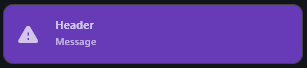
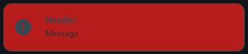

# Notify

`Notify` control is used to display information using a pop-up in-app notification.
`Notify` control inherits from [`Container`](https://flet.dev/docs/controls/container).

## Examples



```python
from flet import *

from flet_contrib.notify import NotifyMode, NotifyOpenDirection, Notify

def main(page: Page):
    
    def open_notify(e):
        notify.open(e.control.text, 'Message', 'Header') # open notify with 'e.control.text' mode
        
    page.add(
        Row(
            tight=True,
            controls=[
                TextButton('test', on_click=open_notify),
                TextButton('warning', on_click=open_notify),
                TextButton('error', on_click=open_notify)
            ]
        )
    )
    
    page.window.width = 700
    page.window.height = 500
    
    page.vertical_alignment = 'center'
    page.horizontal_alignment = 'center'
    
    notify = Notify(
        modes=[
            NotifyMode( # register NotifyMode object with default parameters
                name='test'
            ),
            NotifyMode( # register NotifyMode object with half of parameters
                name='warning',
                color='deeppurple500',
                icon=Icons.WARNING_ROUNDED
            ),
            NotifyMode( # register NotifyMode object with almost all parameters
                name='error',
                color='red900',
                icon=Icons.ERROR_ROUNDED,
                icon_color='bluegrey800',
                header_color='bluegrey800',
                message_color='bluegrey900'
            )
        ],
        open_direction=NotifyOpenDirection.BOTTOM_TO_TOP,
        bottom_to_top_end=Offset(0, 2.9), # set custom end offset. Because default is not enough
        divider_visible=False # turn off divider visibility
    )
    
    page.add(notify)

app(target=main)
```

## Properties

### `modes`

List of notification modes.

### `open_time`

Notification display time.

Defaults to **`3`**

### `open_direction`

Notification animation direction

Defaults to **`NotifyOpenDirection.BOTTOM_TO_TOP`**

### `width`

Width of main notification container

Defaults to **`300`**

### `height`

Height of main notification container

Defaults to **`60`**

### `header_width`

Width of header control

Defaults to **`240`**

### `message_width`

Width of message control

Defaults to **`240`**

### `theme`

Theme of **`Notify`** object

Defaults to **`NotifyTheme()`**

### `padding`

Padding of main notification container

Defaults to **`12`**

### `row_spacing`

Spacing between controls in a row (**`Icon`**, **`VerticalDivider`**, **`Text`**)

Defaults to **`15`**

### `row_alignment`

Alignment of controls in a row (**`Icon`**, **`VerticalDivider`**, **`Text`**)

Defaults to **`'start'`**

### `text_column_spacing`

Spacing between text controls in a column (**`header`**, **`message`**)

Defaults to **`1`**

### `text_column_alignment`

Alignment of text controls in a column (**`header`**, **`message`**)

Defaults to **`'start'`**

### `border_width`

Width of borders of main notification container

Defaults to **`1`**

### `border_radius`

Radius of rounding corners of main notification container

Defaults to **`10`**

### `border_color`

Color of borders of main notification container

Defaults to **`'grey800`**

### `divider_visible`

Visibility of divider between icon and text

Defaults to **`True`**

### `bottom_to_top_start`

Custom start offset for `from bottom to top, centered, at bottom` direction

Defaults to **`DefaultOffsets.bottom_to_top_start`**

### `bottom_to_top_end`

Custom end offset for `from bottom to top, centered, at bottom` direction

Defaults to **`DefaultOffsets.bottom_to_top_end`**

### `bottom_right_to_left_start`

Custom start offset for `from right to left, at bottom` direction

Defaults to **`DefaultOffsets.bottom_right_to_left_start`**

### `bottom_right_to_left_end`

Custom end offset for `from right to left, at bottom` direction

Defaults to **`DefaultOffsets.bottom_right_to_left_end`**

### `bottom_left_to_right_start`

Custom start offset for `from left to right, at bottom` direction

Defaults to **`DefaultOffsets.bottom_left_to_right_start`**

### `bottom_left_to_right_end`

Custom end offset for `from left to right, at bottom` direction

Defaults to **`DefaultOffsets.bottom_left_to_right_end`**

### `top_to_bottom_start`

Custom start offset for `from top to bottom, centered, at top` direction

Defaults to **`DefaultOffsets.top_to_bottom_start`**

### `top_to_bottom_end`

Custom end offset for `from top to bottom, centered, at top` direction

Defaults to **`DefaultOffsets.top_to_bottom_end`**

### `top_right_to_left_start`

Custom start offset for `from right to left, at top` direction

Defaults to **`DefaultOffsets.top_right_to_left_start`**

### `top_right_to_left_end`

Custom end offset for `from right to left, at top` direction

Defaults to **`DefaultOffsets.top_right_to_left_end`**

### `top_left_to_right_start`

Custom start offset for `from left to right, at top` direction

Defaults to **`DefaultOffsets.top_left_to_right_start`**

### `top_left_to_right_end`

Custom end offset for `from left to right, at top` direction

Defaults to **`DefaultOffsets.top_left_to_right_end`**